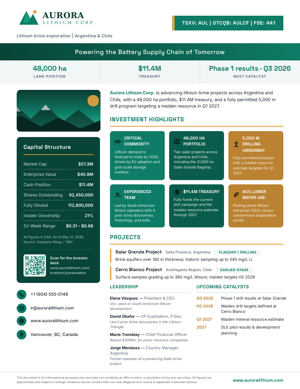
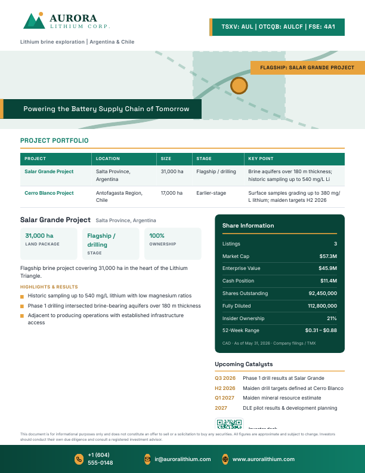
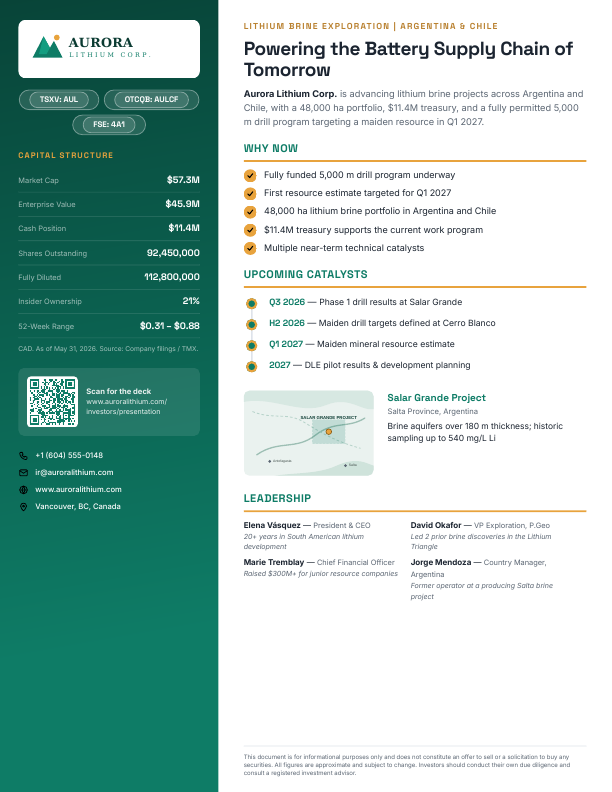

# onepager

Turn public company information into a **conference-ready investor one-pager PDF**.
Feed it a description, tickers, the latest cap table, projects, and a logo — it
computes the capital-markets math (enterprise value, market cap), builds a 3-metric
headline strip, generates a scannable QR code, applies a commodity-aware color theme,
and renders a polished US-Letter or A4 page in one of three purpose-built templates.

| `factsheet` | `asset` | `catalyst` |
| --- | --- | --- |
|  |  |  |
| **Corporate snapshot / investor factsheet.** Logo, ticker, commodity & jurisdiction, a 3-metric strip, hero visual, capital-markets sidebar (with enterprise value + QR), evidence-based highlights, projects, leadership, and upcoming catalysts. | **Project / asset-focused.** Leads with the flagship asset and a large visual, a comparable-projects table (location / size / stage / key point), flagship stat chips and results. | **Catalyst / conference handout.** Tight headline, a "Why Now" checklist, an upcoming-catalyst timeline, capital structure, leadership, and a scannable QR code. |

Pick the template by company stage: early-exploration and producers suit `factsheet`,
a drill discovery or single flagship suits `asset`, and active conference / financing
outreach suits `catalyst`.

## Installation

The CLI and web app share one core install. Local PDF rendering uses WeasyPrint,
which needs the Pango/Cairo system libraries (preinstalled on most Linux distros,
`brew install pango` on macOS) — install it via the `pdf` extra:

```bash
pip install -e ".[pdf]"     # CLI + web UI + native PDF engine (recommended)
pip install -e .            # core only; web UI works, PDF falls back to a browser printer
# or just the dependencies:
pip install -r requirements.txt
```

## Quick start

```bash
# Scaffold a profile to fill in
onepager init my-company.json

# Render with one template
onepager build my-company.json --template factsheet -o my-company.pdf

# Render all three templates at once
onepager build my-company.json --all -o output/

# Pick a print size: US Letter (default) or A4
onepager build my-company.json -t catalyst --page-size a4

# List templates and available highlight icons
onepager templates --icons
```

Try the included examples:

```bash
onepager build examples/aurora-lithium.json --all -o output/
onepager build examples/northbeam-health.json --all -o output/
```

(If you haven't installed the package, substitute `python3 -m onepager.cli` for
`onepager`.)

## Browser UI

```bash
pip install -e ".[pdf]"
onepager serve              # → http://localhost:8000
```

The web UI is a guided, single-page builder — no JSON required:

1. **Who is the company?** Name, tickers, a 2–4 sentence description (copy it from
   the company's About page or latest press release), and contact details.
2. **What does the brand look like?** Upload the logo and an optional hero image;
   brand colors are auto-extracted from raster logos or set explicitly.
3. **What's the share structure?** Upload the latest cap table as **Excel, CSV, or
   PDF — or just paste the rows as text** — and the parser fills in share price,
   shares outstanding, options, warrants, market cap, etc. Every parsed value lands
   in an editable field for review; fully diluted and market cap are computed when
   left blank.
4. **Why should investors care?** Highlights, projects, leadership, and news as
   simple one-line entries.
5. Pick a template and a print size — US Letter (8.5 × 11 in, the conference-handout standard) or A4 — then generate, preview, and download.

One-click example loading fills the whole form, and a **JSON (advanced)** tab gives
full programmatic control over the profile (including a "copy form into JSON"
button).

## Deployment

### Vercel (zero config)

Import the repo into Vercel and deploy — `vercel.json` is already set up. The app
runs as two serverless functions:

- `api/index.py` — the FastAPI app (builder UI, cap table parsing, templating).
  All non-`/api` routes rewrite here, so the builder is the homepage.
- `api/pdf.js` — a Chromium PDF printer (`@sparticuz/chromium` + `puppeteer-core`).
  WeasyPrint's native libraries can't load in serverless Python, so `/generate`
  detects that and returns self-contained HTML (fonts and images inlined as data
  URIs), which the browser forwards to `/api/pdf` for printing. Output is verified
  to match the WeasyPrint rendering.

Expect a few seconds of cold start on the first PDF while Chromium boots.

### Docker (Render, Railway, Fly.io, or any container host)

Runs the same app with the native WeasyPrint engine — single function, no
Chromium:

```bash
docker build -t onepager .
docker run -p 8000:8000 onepager
```

## The profile JSON

Everything an investor needs lives in one file. All sections are optional except
`company.name` — templates gracefully skip whatever is missing.

```jsonc
{
  "company": {
    "name": "Aurora Lithium Corp.",
    "tagline": "Powering the Battery Supply Chain of Tomorrow", // the headline
    "commodity": "Lithium brine exploration",  // subhead + commodity color theme
    "jurisdiction": "Argentina & Chile",        // subhead
    "stage": "Drill-stage exploration",         // drives template recommendation
    "description": "is advancing lithium brine projects ...", // continues the name
    "sector": "Lithium Exploration & Development",
    "website": "www.auroralithium.com",
    "deck_url": "www.auroralithium.com/investors", // becomes the QR code; defaults to website
    "email": "ir@auroralithium.com",
    "phone": "+1 (604) 555-0148",
    "address": "Vancouver, BC, Canada",
    "logo": "assets/logo.svg",        // path relative to this JSON; SVG/PNG/JPG
    "hero_image": "assets/hero.svg"   // hero / banner visual
  },
  "listings": [
    { "exchange": "TSXV", "ticker": "AUL" },
    { "exchange": "OTCQB", "ticker": "AULCF" }
  ],
  "key_metrics": [                    // the 3-metric headline strip; auto-derived if omitted
    { "label": "Land Position", "value": "48,000 ha" },
    { "label": "Treasury", "value": "$11.4M" },
    { "label": "Next Catalyst", "value": "Phase 1 results · Q3 2026" }
  ],
  "share_structure": {
    "as_of": "May 31, 2026",          // quote date
    "currency": "CAD",                // shown with the market data
    "source": "Company filings / TMX",
    "share_price": 0.62,              // numbers are auto-formatted ($, commas, $57.3M)
    "shares_outstanding": 92450000,
    "options": 6150000,
    "warrants": 14200000,
    "debt": 0,
    "fully_diluted": null,            // omit → computed from shares + options + warrants
    "market_cap": null,               // omit → computed from price × shares outstanding
    "enterprise_value": null,         // omit → computed as market cap − cash + debt
    "week52_range": "$0.31 – $0.88",
    "cash_position": 11400000,
    "insider_ownership": "21%"
  },
  "highlights": [                     // the "why invest" story — include a number in each
    { "icon": "map", "title": "48,000 ha Portfolio", "text": "Two salar projects ..." }
  ],
  "catalysts": [                      // upcoming catalysts (default over news)
    { "timing": "Q3 2026", "catalyst": "Phase 1 drill results at Salar Grande" }
  ],
  "why_now": [                        // conference handout reasons (catalyst template)
    "Fully funded 5,000 m drill program underway"
  ],
  "projects": [                       // assets, properties, or business units
    {
      "name": "Salar Grande Project",
      "location": "Salta Province, Argentina",
      "size": "31,000 ha", "stage": "Flagship / drilling", "ownership": "100%",
      "key_point": "Brine aquifers over 180 m thickness",   // the asset table's last column
      "summary": "Flagship brine project covering 31,000 ha ...",
      "bullets": ["Historic sampling up to 540 mg/L lithium", "..."],
      "image": "assets/map.svg"
    }
  ],
  "team": [ { "name": "Elena Vásquez", "title": "President & CEO",
             "note": "20+ years in South American lithium development" } ],
  "news": [ { "date": "2026-05-12", "title": "Phase 1 drilling confirms ..." } ],
  "brand": { "primary": "#0E7C66", "accent": "#E8A33D" },
  "disclaimer": "Optional custom disclaimer text."
}
```

### Computed automatically

- **Fully diluted** = shares outstanding + options + warrants (when omitted).
- **Market cap** = share price × shares outstanding (when omitted).
- **Enterprise value** = market cap − cash + debt (when omitted).
- **Key-metrics strip** is derived from treasury, market cap, and the next catalyst
  when `key_metrics` isn't supplied.
- **QR code** is generated from `deck_url` (or the website) as an inline SVG.

### Colors

Color precedence is **explicit `brand.primary` → color extracted from a raster
logo → commodity theme → default**. Set a `commodity` (lithium, copper, gold,
silver, uranium, rare earths, nickel, graphite, potash, …) for an on-theme default
palette, or pass `brand.primary` / `brand.accent` for full control.

### Highlight icons

`growth, network, education, leaf, shield, flask, globe, users, dollar, target,
battery, gear, map, drill, star, handshake, building, bolt` — set per highlight via
the `icon` field.

### Validation

`onepager` flags gaps that weaken an investor handout — missing quote date,
currency, data source, jurisdiction, catalyst, visual, or contact; a market cap that
doesn't reconcile with price × shares; highlights with no number; and over-length
copy. The web builder shows these as review notes after generating; they're advisory
and never block rendering.

## Fitting on one page

Output is a single page at standard print size — US Letter by default, A4 via
`--page-size a4` — so companies can print copies for conferences and investor
meetings. Content is curated, not paginated. Guidelines that render well:

- **Highlights:** up to 6 (`asset` leads with the flagship; `catalyst` turns titles
  into "Why Now" reasons when `why_now` is absent).
- **Projects:** 2–3 with bullets; `asset` lists them all in the comparison table.
- **Catalysts:** up to 5 (preferred over news on every template).
- **Description:** 2–4 sentences, rendered as a continuation of the bolded company
  name ("**Acme Corp.** is a ...").

If you supply much more than this, the page clips overflow rather than spilling onto
a second page — trim the profile until everything shows.

## Project layout

```
onepager/
├── cli.py          # argparse CLI (build / templates / serve / init)
├── web.py          # FastAPI builder UI + /generate, /parse-captable, /validate
├── profile.py      # JSON loading, normalization, EV / derived fields
├── captable.py     # cap-table parsing (xlsx / csv / pdf / pasted text)
├── colors.py       # palette derivation, commodity themes, logo color extraction
├── qr.py           # QR-code generation (segno → inline SVG)
├── validate.py     # advisory warnings + stage→template recommendation
├── icons.py        # built-in inline-SVG icon set
├── render.py       # Jinja2 + WeasyPrint rendering, page sizes
├── fonts/          # bundled Inter + Space Grotesk (OFL licensed)
└── templates/
    ├── factsheet/page.html
    ├── asset/page.html
    └── catalyst/page.html
examples/           # two complete fictional sample profiles + assets
```

### Adding a template

Drop a `page.html` (Jinja2, self-contained CSS, A4 fixed layout) into
`onepager/templates/<name>/` and register the name with a description in
`TEMPLATES` in `render.py`. Templates receive the normalized context produced by
`profile.load_profile` plus a `font_faces` CSS block and the `|icon` filter.

## Notes

- The example companies (Aurora Lithium, Northbeam Health) are **fictional** —
  they exist to demonstrate the templates.
- Bundled fonts are licensed under the SIL Open Font License.
- The default disclaimer is boilerplate, not legal advice; supply your own via the
  `disclaimer` field as needed.
