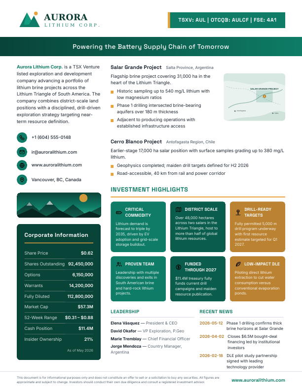
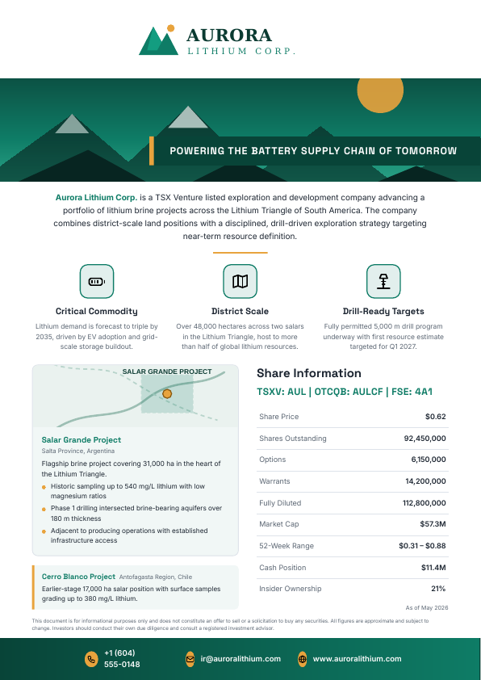
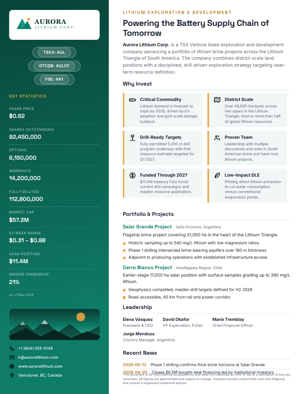

# onepager

Generate beautifully designed, investor-ready **one-pager PDFs** for publicly listed
companies from a single JSON profile. Feed it the information you'd pull from public
sources — description, tickers, share structure, projects, highlights, logo, images —
and it renders a polished A4 PDF using one of three built-in templates.

| `boardroom` | `horizon` | `summit` |
| --- | --- | --- |
|  |  |  |
| Structured two-column corporate layout with a dark stats panel and an investment-highlights grid. | Hero-image layout with centered branding, icon feature cards, and a share-information table. | Modern full-height brand sidebar with large display type and stacked key statistics. |

## Installation

Requires Python 3.10+ and the WeasyPrint system libraries (Pango/Cairo — preinstalled
on most Linux distros, `brew install pango` on macOS).

```bash
pip install -e .            # CLI only
pip install -e ".[web]"     # CLI + browser UI
# or just the dependencies:
pip install -r requirements.txt
```

## Quick start

```bash
# Scaffold a profile to fill in
onepager init my-company.json

# Render with one template
onepager build my-company.json --template summit -o my-company.pdf

# Render all three templates at once
onepager build my-company.json --all -o output/

# List templates and available highlight icons
onepager templates --icons
```

Try the included examples:

```bash
onepager build examples/aurora-lithium.json --all -o output/
onepager build examples/northbeam-health.json --all -o output/
```

(If you haven't installed the package, substitute `python3 -m onepager.cli` for
`onepager`.)

## Browser UI

```bash
pip install -e ".[web]"
onepager serve              # → http://localhost:8000
```

The web UI lets you paste/edit the profile JSON (with one-click example loading),
upload a logo and hero image, pick a template, and preview/download the generated
PDF — no command line needed after startup.

## Deployment

PDF rendering uses WeasyPrint, which depends on native Pango/Cairo libraries, so the
generator needs a real Python host — it **cannot run on static/serverless platforms
like Vercel or GitHub Pages**. Two options are included:

- **Docker** (works on Render, Railway, Fly.io, or any container host):

  ```bash
  docker build -t onepager .
  docker run -p 8000:8000 onepager
  ```

- **Static landing page** (`index.html` + `vercel.json`): if the repo is connected to
  Vercel, the deployment serves a project landing page with template previews and
  run instructions instead of a 404.

## The profile JSON

Everything an investor needs lives in one file. All sections are optional except
`company.name` — templates gracefully skip whatever is missing.

```jsonc
{
  "company": {
    "name": "Aurora Lithium Corp.",
    "tagline": "Powering the Battery Supply Chain of Tomorrow",
    "description": "is a TSX Venture listed exploration company ...", // continues the company name
    "sector": "Lithium Exploration & Development",
    "website": "www.auroralithium.com",
    "email": "ir@auroralithium.com",
    "phone": "+1 (604) 555-0148",
    "address": "Vancouver, BC, Canada",
    "logo": "assets/logo.svg",        // path relative to this JSON; SVG/PNG/JPG
    "hero_image": "assets/hero.svg"   // used by the horizon template
  },
  "listings": [
    { "exchange": "TSXV", "ticker": "AUL" },
    { "exchange": "OTCQB", "ticker": "AULCF" }
  ],
  "share_structure": {
    "as_of": "May 2026",
    "share_price": 0.62,              // numbers are auto-formatted ($, commas, $57.3M)
    "shares_outstanding": 92450000,
    "options": 6150000,
    "warrants": 14200000,
    "fully_diluted": null,            // omit → computed from the three fields above
    "market_cap": null,               // omit → computed from price × shares outstanding
    "week52_range": "$0.31 – $0.88",
    "cash_position": 11400000,
    "insider_ownership": "21%",
    "extra": [                        // any additional rows
      { "label": "ARR", "value": "$112M" }
    ]
  },
  "highlights": [                     // the "why invest" story
    { "icon": "battery", "title": "Critical Commodity", "text": "Lithium demand ..." }
  ],
  "projects": [                       // assets, properties, or business units
    {
      "name": "Salar Grande Project",
      "location": "Salta Province, Argentina",
      "summary": "Flagship brine project covering 31,000 ha ...",
      "bullets": ["Historic sampling up to 540 mg/L lithium", "..."],
      "image": "assets/map.svg"
    }
  ],
  "team": [ { "name": "Elena Vásquez", "title": "President & CEO" } ],
  "news": [ { "date": "2026-05-12", "title": "Phase 1 drilling confirms ..." } ],
  "brand": { "primary": "#0E7C66", "accent": "#E8A33D" },
  "disclaimer": "Optional custom disclaimer text."
}
```

### Brand colors

If `brand.primary` is omitted and the logo is a raster image (PNG/JPG), the dominant
saturated color is **extracted from the logo automatically** and the whole palette —
backgrounds, tints, panels, tiles — is derived from it. Provide `brand.primary` /
`brand.accent` explicitly for full control (always recommended for SVG logos).

### Highlight icons

`growth, network, education, leaf, shield, flask, globe, users, dollar, target,
battery, gear, map, drill, star, handshake, building, bolt` — set per highlight via
the `icon` field.

## Fitting on one page

These are fixed, single-page layouts; content is curated, not paginated. Guidelines
that render well:

- **Highlights:** up to 6 (`horizon` shows the first 3 as feature cards).
- **Projects:** 2 with bullets (`horizon` renders the first as a full card with image
  and the rest as compact rows).
- **News:** 2–3 items (`summit` shows 2, `boardroom`/`horizon` show up to 3).
- **Description:** 2–4 sentences. It is rendered as a continuation of the bolded
  company name ("**Acme Corp.** is a ...").

If you supply much more than this, the page clips overflow rather than spilling onto
a second page — trim the profile until everything shows.

## Project layout

```
onepager/
├── cli.py          # argparse CLI (build / templates / init)
├── profile.py      # JSON loading, validation, number formatting, derived fields
├── colors.py       # palette derivation + logo color extraction
├── icons.py        # built-in inline-SVG icon set
├── render.py       # Jinja2 + WeasyPrint rendering
├── fonts/          # bundled Inter + Space Grotesk (OFL licensed)
└── templates/
    ├── boardroom/page.html
    ├── horizon/page.html
    └── summit/page.html
examples/           # two complete fictional sample profiles + assets
```

### Adding a template

Drop a `page.html` (Jinja2, self-contained CSS, A4 fixed layout) into
`onepager/templates/<name>/` and register the name with a description in
`TEMPLATES` in `render.py`. Templates receive the normalized context produced by
`profile.load_profile` plus a `font_faces` CSS block and the `|icon` filter.

## Notes

- The example companies (Aurora Lithium, Northbeam Health) are **fictional** —
  they exist to demonstrate the templates.
- Bundled fonts are licensed under the SIL Open Font License.
- The default disclaimer is boilerplate, not legal advice; supply your own via the
  `disclaimer` field as needed.
